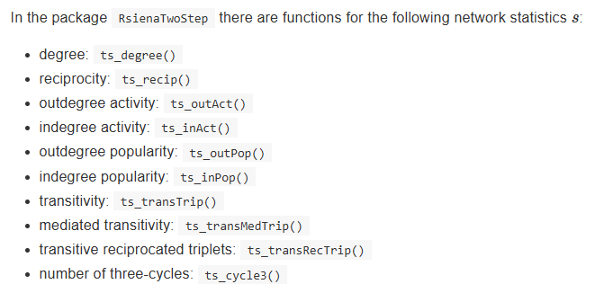

```{r setup, include=FALSE}
knitr::opts_chunk$set(echo = TRUE)
```

# Workshop 07-09-2026

## *Summary*

In the workshop we did the following:

-   Student presentations on first ideas RQs and literature

-   Ashwin's presentation on his data

-   Started figuring out some descriptive statistics

## *Current to-do list*

-   Update my RQs and prepare presentation for next time

    -   Start writing introduction

    -   Think about data

-   Read chapter 6 (and scan 8) of SNASS

-   Continue figuring out the descriptives

-   Update lab journal and website

# Lab Journal

## Installing and prepping packages

```{r setup, include=FALSE, echo = F, warning = F}
knitr::opts_chunk$set(tidy = T, results = 'hold', echo = F, warning = F, message = F)
```

```{r}
# install.packages("RSiena")
# install.packages("igraph")
# install.packages("styler")
# install.packages("network")
library(RSiena)
library(igraph)
library(network)
```

## Descriptive statistics

More info here: <https://rpubs.com/bunnificent/862631>

```{r}
# the data
s501
?s501
summary(s501)
str(s501)
attributes(s501)
rm(list = ls())

network(s501)
 summary(flo,
          print.adj = TRUE
          )
 
 flo.stat<-
        network(
        s501,
        directed=F,
        matrix.type="adjacency"
        )

?igraph
 
vcount(graph) # count vertices / actors
ecount(graph) # count edges / ties
is_bipartite(graph) # is the network unimodal or multi?
is_weighted(graph) # are edges weigthed or unweighted?

# EGO CHARACTERISTICS -------------------------------------------------------
# indegrees, outdegrees, skewness van distributions

ts_degree(net = options[[1]], ego = ego) # number of ties ego sends to alters = outdegrees
lapply(options, ts_recip, ego = ego) # number of reciprocated ties


# DYADS / TRIADS ------------------------------------------------------------
# dyad and triad census
graph <- graph_from_adjacency_matrix(s501, mode = "directed")
graph
?triad_census
triad_census(graph)

?dyad_census
dyad_census(graph)
# $mut = number of pairs with mutual connections = 39
# $asym = number of pairs with non-mutual connections = 35
# $null = number of pairs with no connections between them = 1151

# PATH LENGTH
# calculate for each path length the proportion of nodes each node can reach and take the average value of that
mean((ego_size(graph, order = 2, mode = "out") - 1)/vcount(graph))
# path length is set to 2 here
```



## Moran's I

From @SNASS Chapter 6

```{r}
# RQ: Is the network segregated based on drinking behavior?

# OPTION 1: WITH PACKAGE 'SNA'
# install.packages("sna")
require(RSiena)
library(network)
friend.data.w1 <- s501
friend.data.w2 <- s502
friend.data.w3 <- s503
drink <- s50a
smoke <- s50s

net1 <- network::as.network(friend.data.w1)
net2 <- network::as.network(friend.data.w2)
net3 <- network::as.network(friend.data.w3)

# nacf does not row standardize!
snam1 <- sna::nacf(net1, drink[, 1], type = "moran", neighborhood.type = "out", demean = TRUE)
snam1[2]  #the first order matrix is stored in second list-element
# Moran's I = 0.433


# OPTION 2: WITH PACKAGE 'APE'
# install.packages("ape")
require(ape)
require(sna)
geodistances <- geodist(net1, count.paths = TRUE)
geodistances <- geodistances$gdist

# first define a nb based on distance 1.
weights1 <- geodistances == 1

# this function rowstandardizes by default
ape::Moran.I(drink[, 1], scaled = FALSE, weight = weights1, na.rm = TRUE)
# Moran's I = 0.486


# OPTION 3: JOCHEM'S OWN FUNCTION
# without rowstandardize
fMoran.I <- function(x, weight, scaled = FALSE, na.rm = FALSE, alternative = "two.sided", rowstandardize = TRUE) {
    if (rowstandardize) {
        if (dim(weight)[1] != dim(weight)[2])
            stop("'weight' must be a square matrix")
        n <- length(x)
        if (dim(weight)[1] != n)
            stop("'weight' must have as many rows as observations in 'x'")
        ei <- -1/(n - 1)
        nas <- is.na(x)
        if (any(nas)) {
            if (na.rm) {
                x <- x[!nas]
                n <- length(x)
                weight <- weight[!nas, !nas]
            } else {
                warning("'x' has missing values: maybe you wanted to set na.rm = TRUE?")
                return(list(observed = NA, expected = ei, sd = NA, p.value = NA))
            }
        }
        ROWSUM <- rowSums(weight)
        ROWSUM[ROWSUM == 0] <- 1
        weight <- weight/ROWSUM
        s <- sum(weight)
        m <- mean(x)
        y <- x - m
        cv <- sum(weight * y %o% y)
        v <- sum(y^2)
        obs <- (n/s) * (cv/v)
        if (scaled) {
            i.max <- (n/s) * (sd(rowSums(weight) * y)/sqrt(v/(n - 1)))
            obs <- obs/i.max
        }
        S1 <- 0.5 * sum((weight + t(weight))^2)
        S2 <- sum((apply(weight, 1, sum) + apply(weight, 2, sum))^2)
        s.sq <- s^2
        k <- (sum(y^4)/n)/(v/n)^2
        sdi <- sqrt((n * ((n^2 - 3 * n + 3) * S1 - n * S2 + 3 * s.sq) - k * (n * (n - 1) * S1 - 2 * n *
            S2 + 6 * s.sq))/((n - 1) * (n - 2) * (n - 3) * s.sq) - 1/((n - 1)^2))
        alternative <- match.arg(alternative, c("two.sided", "less", "greater"))
        pv <- pnorm(obs, mean = ei, sd = sdi)
        if (alternative == "two.sided")
            pv <- if (obs <= ei)
                2 * pv else 2 * (1 - pv)
        if (alternative == "greater")
            pv <- 1 - pv
        list(observed = obs, expected = ei, sd = sdi, p.value = pv)
    } else {
        if (dim(weight)[1] != dim(weight)[2])
            stop("'weight' must be a square matrix")
        n <- length(x)
        if (dim(weight)[1] != n)
            stop("'weight' must have as many rows as observations in 'x'")
        ei <- -1/(n - 1)
        nas <- is.na(x)
        if (any(nas)) {
            if (na.rm) {
                x <- x[!nas]
                n <- length(x)
                weight <- weight[!nas, !nas]
            } else {
                warning("'x' has missing values: maybe you wanted to set na.rm = TRUE?")
                return(list(observed = NA, expected = ei, sd = NA, p.value = NA))
            }
        }
        # ROWSUM <- rowSums(weight) ROWSUM[ROWSUM == 0] <- 1 weight <- weight/ROWSUM
        s <- sum(weight)
        m <- mean(x)
        y <- x - m
        cv <- sum(weight * y %o% y)
        v <- sum(y^2)
        obs <- (n/s) * (cv/v)
        if (scaled) {
            i.max <- (n/s) * (sd(rowSums(weight) * y)/sqrt(v/(n - 1)))
            obs <- obs/i.max
        }
        S1 <- 0.5 * sum((weight + t(weight))^2)
        S2 <- sum((apply(weight, 1, sum) + apply(weight, 2, sum))^2)
        s.sq <- s^2
        k <- (sum(y^4)/n)/(v/n)^2
        sdi <- sqrt((n * ((n^2 - 3 * n + 3) * S1 - n * S2 + 3 * s.sq) - k * (n * (n - 1) * S1 - 2 * n *
            S2 + 6 * s.sq))/((n - 1) * (n - 2) * (n - 3) * s.sq) - 1/((n - 1)^2))
        alternative <- match.arg(alternative, c("two.sided", "less", "greater"))
        pv <- pnorm(obs, mean = ei, sd = sdi)
        if (alternative == "two.sided")
            pv <- if (obs <= ei)
                2 * pv else 2 * (1 - pv)
        if (alternative == "greater")
            pv <- 1 - pv
        list(observed = obs, expected = ei, sd = sdi, p.value = pv)
    }


}

fMoran.I(drink[, 1], scaled = FALSE, weight = weights1, na.rm = TRUE, rowstandardize = FALSE)
# Moran's I = 0.4331
# same result as nacf function (in option 1)


# Finally, calculate a correlation where connected actors further away from i weigh less

# step 1: calculate distances
geodistances <- geodist(net1, count.paths = TRUE)
geodistances <- geodistances$gdist
# set the distance to yourself as Inf
diag(geodistances) <- Inf


# step 2: define a distance decay function. This one is pretty standard in the spatial autocorrelation literature but actually pretty arbitrary.
weights2 <- exp(-geodistances)

# step 3: I dont want to rowstandardize.
fMoran.I(drink[, 1], scaled = FALSE, weight = weights2, na.rm = TRUE, rowstandardize = FALSE)

# Corr = 0.281
# Conclusion: yes, pupils closer to one another are more alike! And ‘closer’ here means a shorter path length. You also observe that the correlation is lower than we calculated previously. Apparently, we are similar to alters very close by (path length one) and less so (or even dissimilar) to alters further off.
```

## Random graphs

```{r}
require(igraph)
dens <- round(graph.density(smallworld), 2)  #save density of smallworld
trial <- 1000  #set number of trials/sims
trialclus <- triallen <- rep(NA, trial)  #define objects in which you are saving results


for (i in 1:trial) {
    random_graph <- erdos.renyi.game(n = 105, p.or.m = dens, directed = FALSE)  #make the random graph
    triallen[i] <- average.path.length(random_graph, unconnected = TRUE)  #calculate average path length
    trialclus[i] <- transitivity(random_graph, isolates = c("NaN"))  #calculate clustering
}


par(mfrow = c(1, 2))
{
    hist(trialclus, xlim = c(0.1, 0.36), main = "average clustering coefficient", xlab = "", )
    abline(v = transitivity(smallworld, isolates = c("NaN")), col = "red", lwd = 3)
}

{
    hist(triallen, xlim = c(1.9, 2.2), main = "average path length", xlab = "")
    abline(v = average.path.length(smallworld, unconnected = TRUE), col = "red", lwd = 3)
}
```

## Smallworldliness

```{r}
C <- transitivity(smallworld, isolates = c("NaN"))
Cr <- mean(trialclus)
L <- average.path.length(smallworld, unconnected = TRUE)
Lr <- mean(triallen)
Sigma <- (C/Cr)/(L/Lr)
print("The smallworldness of Smallworld is:")
Sigma # 2.273, which is >1 so considered a small world network
```
